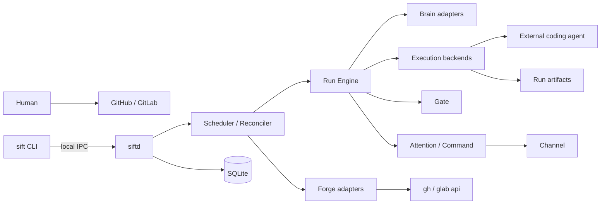

> 已融合进 [DESIGN.md](../DESIGN.md)；取舍记录见其 §14.4。本文只作过程留档。

# Sift — 技术设计方案（Codex 提案）

## 1. 目标与边界

本文展开 [PRD](PRD.md) 已确定的需求与架构约束，回答 Sift V0 如何以最小复杂度形成可靠闭环。PRD §13.1 的选择视为输入，不在本文重议；字段级配置、数据库表、接口与命令契约后续下沉到 `specs/`。

设计目标按优先级排序：

1. 状态转移、门禁与审批可确定性复现和审计。
2. `siftd` 崩溃或重启后，不丢 Run、不重复副作用、不产生幽灵进程。
3. GitHub、GitLab 从第一天共享领域语义，但保留平台差异。
4. Agent 可长时间运行、可查看现场，且其自报不成为完成依据。
5. 单机单用户 V0 保持简单，同时为后续沙箱执行保留清晰边界。

非目标：分布式调度、微服务、多实例高可用、通用工作流引擎、自建 UI，以及在 V0 内闭合 PRD §9.1 TM6。

## 2. 技术选型

| 层 | 选择 | 理由 |
|---|---|---|
| 语言 | TypeScript（strict） | Forge、LLM、MCP 与配置均以 JSON 为中心；运行时校验与类型可共享 |
| 运行时 | Node.js LTS | 进程、信号、流与跨平台行为成熟；降低守护进程和恢复机制的未知数 |
| 包管理 | pnpm | 锁文件确定、workspace 支持好 |
| 持久化 | SQLite，WAL 模式 | 单机单写者模型匹配；状态、事件与 outbox 可在一个事务中提交 |
| 数据访问 | 迁移脚本 + 薄 SQL repository | 保留 SQL 与事务边界的可见性，不引入重量 ORM |
| Schema | Zod | 配置、Forge 响应和 LLM recommendation 均需运行时校验 |
| CLI | Commander | V0 命令简单、生态稳定 |
| 日志 | Pino + 每 Run 原始日志文件 | 系统日志结构化；Agent 输出保持原貌并可流式查看 |
| 测试 | Vitest | TypeScript 反馈快，便于 fake adapter 与属性测试 |
| 构建 | tsup/esbuild | V0 发布 JS bundle；单文件可执行文件不是成功标准 |

Bun 可作为后续构建/运行对照实验，但 V0 不同时押注其运行时、SQLite 绑定、进程监督和可执行文件打包。若实测证明 Node 分发成本成为主要障碍，可通过 ADR 切换，领域层不依赖 Node 专属 API。

## 3. 总体架构

采用单进程模块化单体。`siftd` 是唯一状态写入者；CLI 通过本地 Unix domain socket 发命令，不直接写数据库。



模块职责遵循 PRD §8，但进程边界只有一个。核心分层如下：

- **领域层**：Run 状态机、Gate 判定、Interrupt 生命周期、预算和鉴权规则；不执行 I/O。
- **应用层**：命令处理、调度、恢复、事务协调和外部副作用编排。
- **适配层**：SQLite、`gh`/`glab`、Agent CLI、tmux、通知 Channel、MCP 与本地 IPC。

依赖只能由适配层指向应用/领域层。LLM、tmux、Forge CLI 都是可替换适配器，不得渗入状态机。

## 4. 一致性与执行模型

### 4.1 单写者与短事务

所有驱动事件先进入 `siftd` 的内部命令队列，由单写者串行提交。耗时 I/O 不得持有数据库事务：事务只完成状态校验、状态更新、事件追加和 outbox 写入。

每次状态变化原子写入：

```text
当前状态条件更新
+ append-only domain event
+ 必要的 outbox operation
+ 预算/游标/幂等记录
```

状态更新使用 compare-and-set：命令必须携带期望状态或版本号。过期命令成为可审计的 no-op，不能覆盖新状态。

### 4.2 Transactional outbox

Forge 评论、标签、创建/合并 Change、通知和启动 Agent 都是不可与 SQLite 共事务的副作用。应用层先写 outbox，再由 worker 执行。

每项副作用有稳定 operation key，例如：

- `run:{run_id}:create-change`
- `interrupt:{interrupt_id}:publish`
- `command:{forge_event_id}:ack`
- `run:{run_id}:merge:{head_sha}`

worker 按至少一次语义执行；适配器先查询或使用平台幂等证据，将重复执行收敛成成功。无法天然幂等的动作必须先写远端标记或执行前复核。

## 5. 持久化设计

SQLite 是本地运行时事实源，Forge 仍是 Issue、Change 与 Checks 的事实源，两者边界遵循 PRD A2。

逻辑数据分为六组：

| 数据组 | 内容 |
|---|---|
| 当前投影 | Run、Interrupt、执行 attempt、预算余额 |
| 事件流 | 状态转移、Agent 上报、Gate 结果、人工命令和恢复动作 |
| Intake | 项目游标、已处理 forge event、幂等键 |
| 副作用 | outbox operation、尝试次数、下次执行时间、结果证据 |
| 校准 | Shadow Gate 预测、人类结果、富特征 Ledger |
| 配置快照 | 启动时有效配置、base 策略版本、指纹 |

数据库启用 WAL、foreign keys 和 busy timeout。迁移只能前向执行，每次启动先备份 schema 元数据并在事务中迁移；未知的新版本数据库拒绝启动。事件表只追加，业务代码无 update/delete 权限入口。

不采用纯事件溯源：当前投影直接服务调度与恢复，事件流服务审计、指标和问题回放。两者在同一事务提交，避免异步投影漂移。

本地目录建议如下，最终路径写入配置 spec：

```text
~/.sift/
  sift.db
  config.*
  runs/<run_id>/
    control.json
    heartbeat
    result.json
    agent.log
```

## 6. Forge 与 Intake

Forge 领域端口仅暴露 PRD §5.2 的最小动词集。GitHub 与 GitLab 适配器通过参数数组启动 `gh api` / `glab api`，禁止 shell 拼接；响应必须通过平台专属 schema 校验后才归一为领域对象。

错误统一为：

- `Transient`：网络、限流和服务端暂时失败，按带抖动退避重试。
- `RateLimited`：尊重远端 reset，并联动 API 预算降速。
- `AuthOrCapability`：停止对应项目摄入并发出一次告警，不循环轰炸。
- `ContractViolation`：保留原始响应摘要，fail closed 并要求人工处理。
- `SemanticConflict`：资源状态已变化，立即重新读取事实源后重新判定。

Intake 为每项目独立调度、共享全局并发限制。游标只在一批事件全部持久化后推进。当前标签状态不能直接触发动作；驱动性事件必须通过 events/timeline 找到 actor，通过 allowlist 后才生成领域命令。Issue/Change 的关闭与合并属于事实观测，按 PRD §4.5 收敛，不套 actor 闸门。

## 7. Run Engine 与 Brain

Run Engine 是唯一合法状态转移入口。每个命令经过：schema 校验、幂等检查、actor/nonce 校验、合法转移校验、预算检查，然后才进入事务。

Brain 端口输入已清洗的结构化上下文，输出 recommendation。每个触点有独立 schema、token 预算、超时和 PRD §5.3 定义的确定性兜底。领域类型明确区分：

```text
Recommendation --不能直接执行--> DomainCommand --状态机验证--> Transition
```

本机 agent CLI 以非交互模式运行，输入优先经 stdin 或临时文件传递，避免命令行长度和 shell 转义问题。原始输出进入受限日志；只有 schema 合法的最终输出进入领域层。

## 8. Runtime：tmux、wrapper 与恢复

### 8.1 后端边界

定义 `ExecutionBackend`，V0 支持：

- `process`：默认后端，直接启动 wrapper，适合稳定的非交互 Agent。
- `tmux`：durable PTY 后端，提供 `attach` 和 daemon 重启后继续运行。

tmux 不是事实源，也不负责最终裁定。它只提供 PTY、会话存续和人工查看。权威日志是 `agent.log`，结构化时间线在 SQLite，完成依据是 wrapper 生成的 `result.json` 加 Gate。

### 8.2 Agent wrapper

任何后端都只能启动 Sift 自带的 wrapper，由 wrapper 再启动 Agent。wrapper 负责：

1. 写入包含 run/attempt、PID、进程组、启动时间和 worktree 的 `control.json`。
2. 将 stdout/stderr 原样追加到 `agent.log`，同时可转发到当前终端或 tmux pane。
3. 定期原子更新 heartbeat。
4. 转发受支持的终止信号，并以进程组为单位回收子进程。
5. Agent 结束后原子写 `result.json`，包含退出码、信号、时间与最终 head SHA。

控制文件采用“写临时文件 + fsync + rename”，避免崩溃留下半个 JSON。tmux session 使用不可注入的内部 ID 命名；调用 tmux 使用 argv，不构造 shell 命令。attach 属于有副作用的人工接管，写入事件流。

### 8.3 重启恢复矩阵

`siftd` 启动后先停止新摄入，逐个核对 running attempt：

| 观测 | 恢复动作 |
|---|---|
| `result.json` 存在且成功 | 校验提交与 head SHA，继续创建 Change/Gate |
| `result.json` 存在且失败 | 进入有限重试或 failed |
| 进程身份匹配且 heartbeat 新鲜 | 重新接管监督 |
| 进程存在但 heartbeat 过期 | 标记异常，限时探测后 fail closed |
| tmux session 在、wrapper 不在 | orphaned attempt，记录失败并保留现场 |
| wrapper 在、tmux session 不在 | 以 wrapper 为准继续监督并告警 |
| 进程身份无法确认 | 不向不确定 PID 发信号，转人工处置 |

进程身份不能只比较 PID，至少组合启动时间、可执行路径和 control nonce，避免 PID 复用误杀其他进程。

## 9. Gate、Attention 与 Command

Gate 是一条可重入的确定性流水线。每一步以 `run_id + head_sha + gate_version` 缓存结果；head SHA 变化即使旧结果失效。策略始终从 base revision 读取，保存策略 blob hash 作为判定证据。

Shadow Gate 从第一天与正式 Gate 同步记录，且在人工决定前冻结预测。回放集导出读取校准记录，不重新拼接已漂移的当前数据。

Attention 将领域 Interrupt 渲染到 forge 评论和 Channel。severity、配额、超时、升级上限由确定性代码计算；LLM 只生成简报草稿。发布失败不改变 Run 已进入 `waiting_human` 的事实，但必须持续重试并在备用 Channel 告警。

Command 对评论/标签事件执行严格解析，只接受当前 nonce、允许 actor 和当前待决 Interrupt。处理结果与回执 outbox 在同一事务写入，因此重复轮询不会重复改变状态。

## 10. MCP 与 Agent 上报

MCP server 只暴露进度、goal、blocker 和完成声明等 PRD §5.8 所需工具。每次调用绑定不可猜测的 run/attempt capability，并校验对应 attempt 仍活跃。

限流、去重与 Interrupt 子配额在 MCP 入口确定性执行。MCP 上报只追加事件或提出 blocker 命令，不能把 Run 标记 done、修改 Gate、调用 Forge 或调整策略。Agent “完成”声明只是时间线事件。

## 11. 配置与安全边界

全局配置在启动时读取、校验并冻结；项目策略从 base 分支读取。有效配置和解析后的 hooks 状态生成指纹。运行期发现敏感文件、`.git/config`、`core.hooksPath` 或最终 hooks 目录变化时：记录安全事件、拒绝热加载，并按严重度停止相关 Run 或转 HITL。

TM6 在 V0 明确不闭合。V0 执行后端命名和诊断输出应如实显示 `unsafe-local`，不得把 worktree 描述为系统沙箱。

后续收口方向是新增 `sandbox-clone` backend：

- 在沙箱内使用完整 clone，不共享宿主 `.git`。
- 仅注入 coding agent 所需凭证，不注入 Forge CLI 凭证与 `~/.sift/`。
- Sift 在宿主侧执行 Forge 动作，并在两侧同步提交对象。
- 逐个验证 Agent 的文件凭证、keychain 和设备绑定兼容性。

不实现“共享 `.git` 的半沙箱”，因为它增加复杂度却保留最关键的越界通路。

## 12. 可观测性与运维

三类信息分开保存：

- 系统日志：结构化 JSON，含 run、attempt、operation 和 forge project correlation ID。
- Agent 日志：逐 Run 原始字节流，轮转但不依赖 tmux scrollback。
- 领域事件：append-only、低基数、用于时间线、指标和审计。

`sift doctor` 检查运行时、SQLite、tmux（仅配置时）、Agent、相关 Forge CLI 登录与版本、项目策略、hooks 指纹和目录权限。某个未配置平台缺少 CLI 不影响启动。

`sift ps/logs/worktree` 默认通过 daemon 获取一致视图；daemon 不可用时只提供明确标记为离线的只读诊断，不直接修改数据库。

## 13. 测试策略

测试按风险而非模块平均分配：

1. **状态机属性测试**：所有非法转移拒绝；终态不可复活；LLM recommendation 无法直接改变状态。
2. **事务与崩溃测试**：在状态更新、事件、outbox 的每个边界注入崩溃，重启后无丢失或重复裁定。
3. **Forge contract fixtures**：保存 GitHub/GitLab API 响应样本，覆盖分页、actor 缺失、限流和平台差异。
4. **Runtime 故障注入**：杀死 siftd、wrapper、Agent 和 tmux server，覆盖恢复矩阵与 PID 复用防护。
5. **Gate 安全测试**：`.sift/**`、CI 配置、base 策略读取与 head SHA 变化必须 fail closed。
6. **幂等测试**：重复事件、评论、标签和 outbox 执行只产生一次领域效果。
7. **端到端测试**：用 fake Forge/Agent 快速跑全链；真实 GitHub/GitLab 各保留一条低频验收链。

PRD §10.1 的重启、并发、负样本与 repo 级安全场景成为发布门禁，而不是人工演示脚本。

## 14. 交付顺序

交付采用纵向切片，但双平台骨架、Shadow Gate 记录器和事件流从第一片开始存在：

1. SQLite、状态机、事件/outbox、fake Forge/Agent 跑通闭环。
2. GitHub 与 GitLab 最小动词适配、Intake、actor 鉴权。
3. `process` backend、wrapper、worktree、重启恢复。
4. Gate、Shadow Gate、回放导出和 Change 创建。
5. Interrupt、Command、首个 Channel、预算与超时升级。
6. tmux backend、attach 与故障注入验证。
7. 真实 Agent 和双平台 PoC 验收。

tmux 不阻塞首个闭环；如果首个 Agent 的非交互模式不稳定，则将第 6 步提前到第 3 步，但 wrapper 契约保持不变。

## 15. 需要 ADR 固化的决策

本文评审通过后，至少追加以下 ADR，避免后续实现无意改写方向：

- TypeScript + Node.js LTS，而非 Bun 作为 V0 生产运行时。
- SQLite 单写者 + 当前投影、事件流和 transactional outbox。
- tmux 是可选 durable PTY 后端，wrapper/SQLite 才是恢复与裁定依据。
- V0 接受 `unsafe-local` TM6 边界，后续以完整 clone 沙箱收口。

其余开放数值与字段继续按 PRD §12 的决策时机下沉到对应 specs，不在 DESIGN 中拍脑袋确定。
