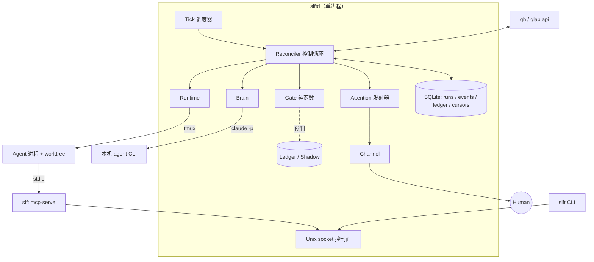

> 已融合进 [DESIGN.md](../DESIGN.md)；取舍记录见其 §14.4。本文只作过程留档。

# Sift — 架构设计（提案稿，待评审）

> 本稿是 `docs/DESIGN.md` 的候选内容之一，评审选定后合入正式文档并删除本文。
> 需求与边界见 [PRD.md](PRD.md)；PRD §13.1 已拍板的约束本文只展开、不重议。
> 字段级契约（数据表列、配置 schema、动词签名、Interrupt 渲染格式）不写在本文，下沉到 `specs/`，见 §16。

---

## 1. 结论摘要

| 决策 | 结论 | 展开于 |
|------|------|--------|
| 技术栈（PRD §12 #15） | Bun + TypeScript，单进程 `siftd`，SQLite(WAL) 单库 | §2 |
| 调度形态 | **控制循环（reconciler）**，非事件回调链 | §4 |
| Gate 形态 | **纯函数**，无 IO；影子门禁与回放集是它的副产品 | §6 |
| 三类预算 | 各只有一个收费口；注意力配额收在 Interrupt 发射器 | §7 |
| Agent 宿主 | tmux 会话，生命周期独立于 `siftd` | §9 |
| MCP 通道 | stdio shim + Unix socket，维持零监听端口 | §11 |
| TM6 收口（PRD §12 #13） | 最小凭证沙箱（`sandbox-exec`）+ `hooksPath` 覆盖；共享 `.git` V0 不切 | §14 |

本文的核心主张：**这套系统的难度在约束的相互作用，不在任何单点技术。** 因此架构的首要任务是把 PRD 里那些「实现阶段容易被顺手简化掉」的约束（回放集、影子门禁常驻、注意力配额、策略从 base 读）变成**结构上无法绕过**的东西，而不是靠纪律去记得遵守。

---

## 2. 技术选型

### 2.1 为什么是 Bun + TypeScript

工作负载画像：无一处 CPU 密集，全部是拉起子进程、解析异构 JSON、写 SQLite、按时钟轮询；并发规模个位数 Run（PRD §9.3 单机单用户）。性能与并发模型因此不构成选型依据，能分出差别的只有三点：

| 依据 | 说明 |
|------|------|
| **边界校验成本** | PRD 强制三处 schema 校验：策略文件启动期校验（§5.7）、LLM 触点输出不合 schema 即兜底（§5.3）、forge 双平台 payload 归一（§5.2）。TS + zod 让三者共用一个 idiom——一份 schema 同时产出运行时校验、静态类型、以及喂给 LLM 的 JSON Schema。这是差距最大的一项 |
| **MCP 服务端成熟度** | Sift 是 MCP **服务端**（§5.8 Layer 1），TypeScript SDK 是该方向最成熟的实现 |
| **Agent CLI 是一等公民** | 全系统对外动作只有三类：`gh/glab api`、`claude -p`、启动 agent 进程。`Bun.spawn` / `Bun.$` / 内置 `bun:sqlite`（同步 API，单写者守护进程正合适）几乎消掉这层胶水 |

放弃的选项与理由：Go 的静态二进制与 `os/exec` 成熟度值得那点冗长——但只在「多机 / 常驻服务 / 对外分发」的前提下，而 PRD 明确不做这三件事；Rust 直接违反 A4（最快闭环优先）；Python 在长跑守护进程与严格状态机上弱于 TS，其唯一优势（pydantic）被 zod 抹平。

### 2.2 三条附加约束（Bun 的风险是长跑稳定性，不是能力）

1. **逃生舱**：Bun 专有 API 只允许出现在三个薄适配模块（`sqlite` / `spawn` / `fs-watch`）。Node 24 的 `node:sqlite` 已稳定，切换 runtime 是改三个文件，不是重写。
2. **禁止把定时器当调度器**：单进程不等于可以到处 `setInterval`。唯一的时间驱动来源是 §4 的 tick。
3. **崩溃可恢复优先于内存效率**：任何状态不得只存在于内存。`kill -9` 后重启必须靠 DB + 外部世界（tmux / forge）重建全部认知，这是 PRD §10.1「恢复」验收标准的实现方式。

---

## 3. 架构总览



模块与 PRD §8 一一对应，不新增模块。进程只有三类：`siftd`（常驻）、`sift`（一次性 CLI，经 Unix socket 与守护进程通话）、`sift mcp-serve`（agent 拉起的薄 shim）。

---

## 4. 控制循环：为什么不是事件回调

webhook 被砍掉、事实源在 forge（A2）之后，这个系统的形态就已经确定了：它是一个 Kubernetes 式 reconciler。每个 tick 做同一件事——读取「forge 的事实 + 本地 Run 状态 + 外部进程实况」，计算差量，**执行一步转移**，落库，结束。

不写「轮询发现变化 → 触发回调链 → 回调里再触发下一步」。收益不是风格偏好：

- **崩溃恢复变成结构性质，而非额外设计。** 重启后第一个 tick 自然会发现「DB 说 `running` 但 tmux 无此会话」并按既有规则收敛。PRD §10.1 的「幽灵 running」是被结构排除的，不是被小心处理掉的。
- **反向同步（PRD §4.5）不需要专门的通道。** forge 侧的事实（Issue 关闭、Change 被人合并）在下一个 tick 就是普通输入，与正向流程走同一段代码。
- **一步一转移让状态机可测。** 每个 tick 是纯粹的 `(观测, 状态) → 转移决策`，可以喂固定观测跑单测。

tick 间隔实现 PRD §5.2 的自适应轮询表；轮询游标与 API 预算计数同表持久化。

**唯一转移入口**（PRD §4.1）实现为 `transition(runId, event)`：内含合法转移表，非法转移抛错而非静默忽略；与事件追加同一个 SQLite 事务。代码层面不存在第二个能写 `runs.status` 的函数——这是靠「没有这个函数」保证，不是靠 review 拦住。

---

## 5. 存储

SQLite 单库（`~/.sift/sift.db`，WAL）。单进程即单写者，不需要连接池，不需要迁移到 Postgres 的抽象层。

| 表 | 性质 | 用途 |
|----|------|------|
| `runs` | 快照 | 当前状态、retry_count、expires_at 等，供 `sift ps` 与 reconciler 快速读 |
| `events` | **只追加** | PRD §9.3 要求的 append-only 事件流；Agent 自报 phase 只进这里（§4.1） |
| `ledger` | 只追加 | 校准账本（PRD §5.9），含影子门禁记录与语义原料 |
| `interrupts` | 快照 + 只追加历史 | Interrupt 本体、升级次数、配额记账 |
| `cursors` / `budgets` | 快照 | 轮询游标、token / API / 注意力三类计数 |

`runs` 是 `events` 的物化视图，但两者同事务写入而非事后重建——重建成本不值得，且快照是 CLI 的读取面。

---

## 6. Gate 是纯函数（本文最不可让的一条）

```
gate(changeFacts, policy, riskScore) → verdict
```

无 IO、无时钟、无网络、不读文件。所有输入由 reconciler 预先取好并冻结成一个快照结构。

**这是 PRD §10.3「回放集必须与 Gate 同期落地」在架构上的唯一表达式。** 影子门禁（§5.6）记录的就是这个函数的输入快照与输出 verdict，于是「离线回放集」不是一个需要额外排期的导出功能，而是「把库里的输入快照重新喂给同一个函数」——两行代码。反过来说，只要 Gate 里出现一行 `await forge.getChecks()`，回放集这件事就会在实现阶段自然死亡，而 T7 随之退化成凭感觉提建议。这正是第三方评审警告的那类「顺手简化」。

推论三条：

- 影子门禁记录器挂在 Gate 的调用点上，**每次调用都记**，无开关。这落实 PRD §3.4「影子门禁是 day-1 常驻记录器，不是一个阶段」。
- `auto_merge` 的证据门槛（§5.6 生效条件）在 Gate **之外**判定——它是策略加载期的一次校验：证据不达标就把 `auto_merge` 从有效策略里剔掉。这样「配置里写了也不生效」是策略层的事实，Gate 只看有效策略，不需要知道证据这回事。
- 风险评分（T3）作为输入传入，Gate 不调用 Brain。

---

## 7. 三类预算：各只有一个收费口

| 预算 | 收费口 | 超限行为 |
|------|--------|----------|
| 每日 token | LLM 客户端（§10） | 全触点走确定性兜底 + 通知 |
| 每小时 forge API | Forge 客户端（§8） | 降级慢轮询 + 告警级通知 |
| **每日注意力** | **Interrupt 发射器**（§12） | 非 critical 合批为每日摘要 |

注意力配额**必须**收在发射器而不是 T6。PRD §5.3 规定配额凌驾于任何触点兜底之上——T6 挂掉走兜底路径时照样要撞到这道墙。收费口只有一个，「不允许借支」才谈得上是机制而不是自觉。critical 熔断（§5.5）同样实现在发射器内：它防的是自己的映射表 bug，所以不能和被它保护的逻辑放在同一层。

severity 由确定性映射函数产生，与 Gate 同样是纯函数，可单测可回放。LLM 的建议只能作为**降级**输入参与，签名上就不接受升级请求。

---

## 8. Forge 适配层

按 PRD §5.2 走 `gh api` / `glab api`（plumbing），封装为最小动词集。三点实现取向：

**归一在边界完成。** 适配器出口只吐 Sift 自己的中性类型，平台字段（`number` / `iid`、`mergeable_state` / `detailed_merge_status`）不允许泄漏到上层。PRD §5.2 的差异清单逐条对应适配器内的一个归一函数；遇到两平台无法都给确定性答案的问题，归一结果是显式的 `unknown`，由上层转 HITL——**不允许适配器猜**。

**契约测试 + fixture 录制。** 用真实 `gh api` / `glab api` 输出录制成 fixture，双平台适配器跑同一套契约测试。这把「Forge 抽象对称性」（PRD §3.4 的三类证据之一）从口号变成 CI 能验的东西，且录制成本几乎为零——反正开发时本来就在敲这些命令。

**actor 回溯是动词的一部分。** `listLabelEvents` / `listIssueComments` / `listChangeComments` 的返回类型里 actor 是必填字段（非可选），取不到时整条事件被丢弃在适配器内。PRD §9.2 的 fail closed 因此是类型系统的结果，而不是每个调用点都要记得检查的约定。

能力探测（`sift doctor`）只探测**已配置项目实际引用到的** forge，见 PRD §5.2 对策表。

---

## 9. Runtime

**worktree 与 tmux。** 每 Run 一个 git worktree（A5）；agent 跑在名为 `sift-<run_id>` 的 tmux 会话里。选 tmux 不是为了好看，是为了**进程生命周期独立于 siftd**：裸子进程会随守护进程重启一起消失，而 tmux 会话仍在，reconciler 用 `tmux list-sessions` 就能核对实况。附带白拿 `sift logs`（`pipe-pane` 落盘）与人工 attach 排查，`sift kill` 就是 kill-session。代价是多一个外部依赖，纳入 `sift doctor` 探测。

**策略从 base 分支读取**（PRD §13.1）：实现为 `git show <base>:.sift/policy.yaml`。代码里**不存在**读 worktree 内策略的函数——TM2 靠「没有这个函数」保证，不靠记得别调。

**Sift 自己的 git 调用一律显式带 `-c core.hooksPath=/dev/null`。** 命令行 `-c` 覆盖 `.git/config`，于是 agent 改配置或重指向 `core.hooksPath` 都伤不到 Sift 的 git 操作。这比指纹校验更强：指纹是事后检测且覆盖面难保证（PRD §9.1 已列出重指向绕过），覆盖是事前失效。指纹校验保留为审计信号，降级为第二道而非唯一防线。

**Change 由 Sift 创建**（PRD §13.1）：reconciler 检测到分支有新提交后调 `createChange`，agent 全程不接触 forge 动词。

---

## 10. Brain

按 PRD §12 #1 走本机 agent CLI（`claude -p --output-format json`）。三点：

- **schema 校验即兜底触发器。** 每个触点 T1–T7 声明一个 zod schema；解析失败重试一次（同一 prompt，不改），再失败即走 PRD §5.3 表格里该触点的确定性兜底。绝不「尽力解析」。
- **token 记账白送。** `claude -p` 的 JSON 输出含 usage，直接进 `budgets` 表——这是 §12 #1 结案选择的附带收益，不需要自己估算。
- **提示词是可版本化资产。** 提示词与 schema 同文件、进 git；回放集（§6）重跑时记录提示词版本，否则「量化改动带来的漏放变化」无从归因。

---

## 11. MCP 通道

PRD §9.3 要求零监听端口，因此不能开 HTTP MCP。链路：

```
Agent ──stdio──> sift mcp-serve（薄 shim）──Unix socket──> siftd
```

- Unix socket（`~/.sift/siftd.sock`，属主 only）不是网络端口，暴露面仍是零。CLI 走同一条 socket。
- shim 注册方式用 `claude --mcp-config <worktree 之外的路径>`，**不往 worktree 里写 `.mcp.json`**——避免把配置放进 agent 自己能改的地方，也避免污染仓库工作副本。
- shim 从环境变量取 `run_id + run_token`，由 siftd 校验，防止 A Run 冒充 B Run 上报。残留暴露面（同用户可窥探进程环境）计入 §14 的未闭合声明。
- **限流是确定性的**（PRD §5.8）：每 Run 的 Interrupt 子配额与上报去重用 DB 里的令牌桶，不经 LLM 判断。触顶本身是异常信号，转一次 HITL 或直接 `failed`。

Layer 1 永不越权：MCP 工具集里**不存在**能写 `runs.status` 的工具，「声明完成」只是一条 event。

---

## 12. Attention 与 Command

**Interrupt 单一发射器。** 生成 Interrupt 的路径只有一条函数入口，配额、critical 熔断、severity 映射、去重都在里面。渲染是发射之后的事：Interrupt 结构 → renderer（forge 评论 markdown / Channel 卡片 / TTS 文本）。PRD §5.5 说「任何渠道都只是渲染器」，实现上就是 renderer 只读 Interrupt，不反向影响是否发射。

`sift speak` 的 visual 红线（PRD §11）实现在 TTS renderer 的入口，而不是 CLI 的参数校验——将来接语音 Channel 时复用同一道拒绝。

**Command 解析零 LLM。** `/sift *` 用手写严格语法解析器（几十行 PEG 或纯 split 即可），解析失败回一条「语法错误 + 可用指令」评论。actor 鉴权、nonce 幂等匹配、执行、回执四步在同一事务内推进。标签路径（`sift:approved`）与评论路径共用同一个鉴权与幂等实现——PRD §9.2 要求统一规则，实现上就该是同一个函数，不是两处相似代码。

---

## 13. 配置与部署

| 项 | 决定 |
|----|------|
| 格式 | YAML（需要注释）+ zod 校验；全局 `~/.sift/config.yaml`，项目 `{repo}/.sift/policy.yaml` |
| 敏感配置 | allowlist / 配额 / Agent 定义 / 全局缺省策略启动期一次性读入 + 指纹校验，运行期不热加载（PRD §13.1）。**改这些配置必须重启 `siftd`——这是设计，不是 bug**（PRD §9.1 已警告实现阶段会有人来「修」它） |
| 项目策略 | 启动期 schema 校验，不通过即拒绝接入，不套默认值兜底 |
| 部署 | `bun build --compile` 出单文件 + launchd plist；日志落 `~/.sift/logs/` |

---

## 14. TM6 收口（PRD §12 #13 结案）

**结论：V0 走「最小凭证沙箱」，明确不闭合，如实声明。** 采纳第三方评审否定二元框架的意见（`reviews/2026-07-27-prd-review-third-party.md` §三）。

| 暴露路径 | V0 处置 | 性质 |
|---------|---------|------|
| `~/.sift/`（allowlist、配额、Agent 定义、DB） | `sandbox-exec` profile deny read/write | 闭合（在 profile 有效的前提下） |
| 已登录的 `gh` / `glab` | deny read `~/.config/gh`、`~/.config/glab`；**放行** `~/.claude/` 等 agent 自身凭证 | 闭合 |
| 共享 `.git`（hooks 投毒） | `git -c core.hooksPath=/dev/null`（§9）+ 指纹审计 | **对 Sift 自身的 git 操作闭合**；对 agent 自己触发 hooks 不闭合 |
| 共享 `.git`（其余写入）与其他 Run 的 worktree | **V0 不切** | 未闭合，如实声明 |
| 进程环境窥探（run_token） | 无对策 | 未闭合 |

三条实现约束：

1. **「零凭证管理」（PRD §5.2）的措辞要加星号**，且星号只指 forge 侧：Sift 不落盘 forge 凭证成立；「Agent 取不到 forge 凭证」在沙箱生效后成立，在沙箱之外不成立。价值主张本身不退化——沙箱里挂的是 agent CLI 自己的凭证，「复用你已订阅的算力」完整保留。
2. **每个 Agent 的鉴权形态必须逐个验证**：凭证以文件形式存放的可挂载，绑 keychain 或设备指纹的挂不进去。这决定「复用订阅」在沙箱下对哪些 Agent 仍然成立，不能假设。首批验证 `claude` 与 `codex`。
3. **共享 `.git` 不切的理由要写在案**：切它等于放弃 worktree、改为 clone + 双向同步，会动 A5，不该在 PoC 阶段付这个代价。彻底解（独立用户 / 容器）保留在 Backlog，立项信号已由 PRD §9.1 给出。

`sandbox-exec` 在 macOS 上是 deprecated 但仍可用；把它当**提高代价与可见性的缓解**，不当边界保证。profile 失效（系统升级移除该命令）时的行为：启动期探测不到即拒绝启动，与 forge CLI 探测同处理——不静默降级成无沙箱运行。

---

## 15. 与 PRD 开放问题的对账

| # | 问题 | 本文处置 |
|---|------|---------|
| 5 | 策略 schema 字段集与漂移判定口径 | 部分：格式与校验时机定在 §13，字段集下沉 `specs/policy.md` |
| 7 | 通知 Channel 具体实现 | 未定。§12 已保证 Channel 是渲染器，换实现不动架构 |
| 10 | 默认硬护栏中 CI 配置路径清单 | 下沉 `specs/gate.md`，与 Gate 同期 |
| 13 | TM6 收口 | **结案，见 §14** |
| 15 | 技术栈 | **结案，见 §2** |
| 3 / 4 / 6 / 8 / 9 / 11 / 12 / 14 | 数值与命名类 | 保持开放；本文只保证它们都是**配置项**而非硬编码，且都有确定性默认值 |

最后一行是本文对这批开放问题的实质贡献：架构不替它们选数值，但保证「选错了改配置就行」。

---

## 16. 待写文档

评审通过后按此清单推进：

| 文档 | 内容 |
|------|------|
| `decisions/001-tech-stack-bun-typescript.md` | §2，含放弃 Go / Rust / Python 的理由与逃生舱约束 |
| `decisions/002-reconciler-over-event-callbacks.md` | §4 |
| `decisions/003-gate-as-pure-function.md` | §6，说明它是 PRD §10.3 的实现方式 |
| `decisions/004-tm6-minimal-credential-sandbox.md` | §14，回答 PRD §12 #13 |
| `specs/forge.md` | 最小动词集签名、中性类型、平台归一表、actor 必填契约 |
| `specs/policy.md` | 策略 schema 字段集、有效策略计算（含 `auto_merge` 证据剔除） |
| `specs/gate.md` | Gate 输入快照结构、判定顺序、默认硬护栏路径清单 |
| `specs/interrupt.md` | Interrupt 字段、severity 映射表、渲染契约 |
| `specs/ledger.md` | 账本字段、回放集导出格式 |
| `specs/mcp.md` | Agent 工具集、限流参数、run_token 校验 |
| `WBS.md` | 里程碑；硬约束两条：回放集与 Gate 同期（PRD §10.3）、影子门禁 day-1 常驻（PRD §3.4） |

---

_提案稿 | 2026-07-27_
